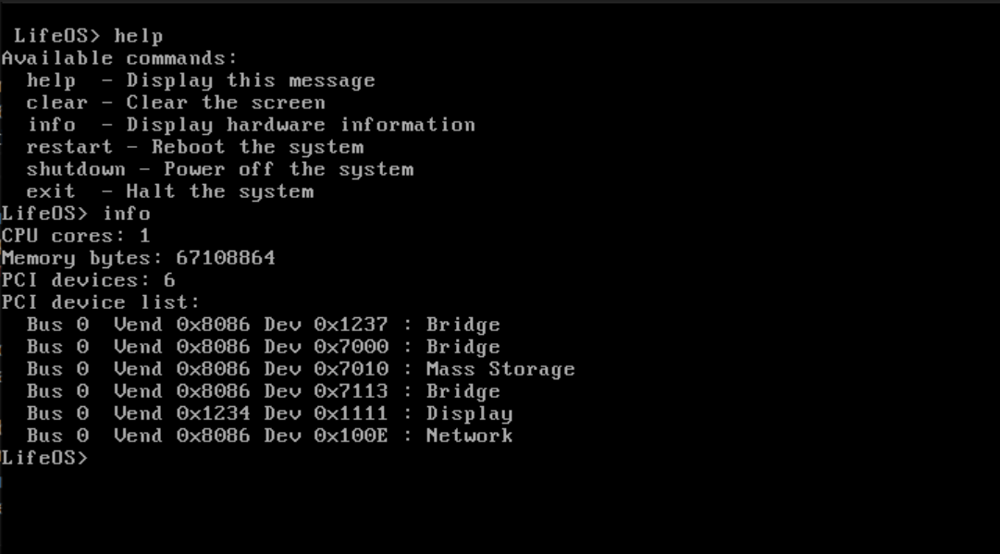

# LifeOS

LifeOS is an emulatable operating system designed to host complex intelligence frameworks. It is scheduled to support virtualization in the coming future. The project aims for minimalist outputs and indirect human control, allowing autonomous operation with optional human intervention. Visual feedback is kept informative and relevant to the active user. Each human machine interface (HMI) is viewed as an input modality to a broader intelligent system that reacts in the best interest of the user and OS. The operating system now targets the x86_64 architecture for improved performance and future expansion.

LifeOS currently boots into a basic terminal with minimal command functionality. The system is being scaffolded in pieces to ensure that it remains fast, flexible, and scalable for varied setups. It will eventually support a sort of 'dual OS', whereby the user can interact with files, while the 'orchestrator' (presumably Elarin) will be able to access resources in a more direct and efficient manner.



The project is built from the ground up with a focus on careful planning before implementation to avoid common OS inefficiencies. All components, from the bootloader to user interaction, will be developed in stages with an emphasis on testability and modularity.

Design documents live under the `Documentation` directory. The `scripts` folder
contains utilities for setting up the build environment. Run
`sudo ./scripts/setup_toolchain.sh` to install the cross compiler and emulator
packages required for development. The helper now installs only the
`x86_64-linux-gnu` toolchain.

After the
toolchain is ready, execute
`./scripts/build_image.sh` to create a bootable image. See
`Documentation/build_environment/build_and_run.txt` for instructions on running
the image under QEMU.

## Quick Start

1. Install the toolchain and emulator packages:
   ```
   sudo ./scripts/setup_toolchain.sh
   ```
2. Build the OS image:
   ```
   ./scripts/build_image.sh
   ```
3. Launch LifeOS in QEMU:
   ```
   LD_PRELOAD=/lib/x86_64-linux-gnu/libpthread.so.0 \
   /usr/bin/qemu-system-x86_64 \
   -drive format=raw,file=build/os-image.bin \
   -serial stdio
   ```
   Use `-enable-kvm` to leverage hardware virtualization for better performance. (experimental)
If QEMU does not display output when multiple GPUs are installed, see 
`Documentation/build_environment/multi_gpu_display.txt` for troubleshooting.


Implementation code lives under the `src` directory. The layout mirrors the OS
components described in the architecture documentation:

- `src/boot`   contains the bootloader.
- `src/kernel` holds the kernel and its subsystems.
- `src/hal`    houses the hardware abstraction layer.
- `src/drivers` stores device drivers.

Refer to `Documentation/source_layout.txt` for a full description of the source
tree.
